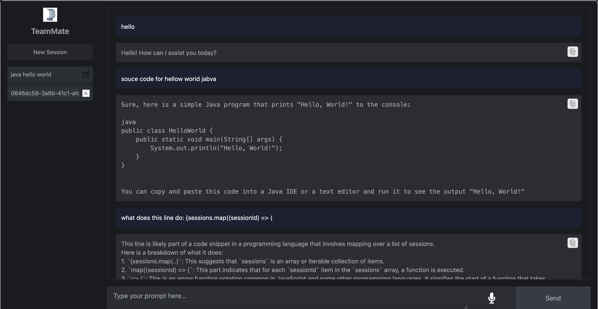

# Team-Mate

TeamMate is a personalized LLM-enhanced agent. It serves as a supportive digital assistant to help students manage their tasks effectively, facilitate collaboration, and access necessary resources effortlessly.  
Key Services Provided by Team-Mate:
- Personalised Interaction: 
- Adaptive Learning and Support: 
- Proactive Planning and Scheduling: 
- Blocker Resolution: 
- Enhance collaboration: 

This repository is the front end of the agent.

## Repository Structure

```
.
├── README.md
├── bun.lockb
├── index.html
├── package.json
├── postcss.config.js
├── public
│   └── logo.png
├── src
│   ├── App.tsx
│   ├── assets
│   ├── context
│   │   └── webSocketContext.tsx
│   ├── hooks
│   │   ├── useConsumer.ts
│   │   ├── usePublisher.ts
│   │   └── useWebSocket.ts
│   ├── index.css
│   ├── main.tsx
│   └── vite-env.d.ts
├── tailwind.config.js
├── tsconfig.json
├── tsconfig.node.json
└── vite.config.ts

6 directories, 18 files
```

## Getting Started

### Project Setup

1. Fork the repository.
2. Clone the repository:
   ```sh
   git clone https://github.com/your-username/team-mate-app.git
   ```
3. Navigate to the project directory:
   ```sh
   cd team-mate-app
   ```
4. Install the required packages:
   ```sh
   bun install
   ```
5. Create a `.env` file in the project root directory with the following variables:
   ```env
   VITE_WEBSOCKET_URL=http://localhost:6789
   ```
6. Run the project:
   ```sh
   bun run dev
   ```

## Important Notes

**Features in the works**
- Delete session
- Remove session leakage
- User accounts
- activate session rename keys
- update knowlage base
- Make search more robust and swicth to vector based
- Upgrade model? cost vs performance

## License

This project is licensed under the MIT License.



